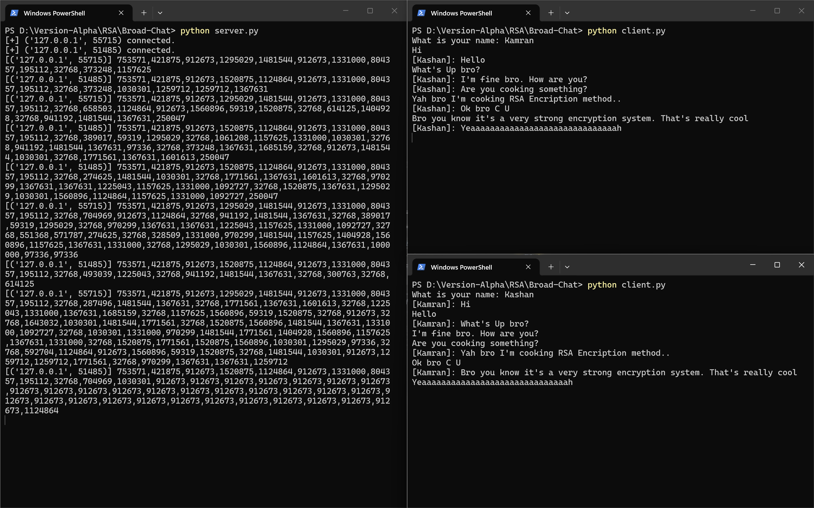
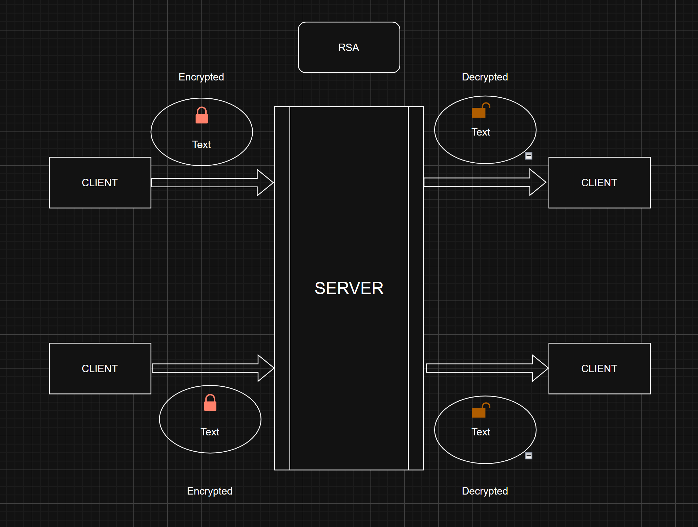

# 🔐 BROAD-CHAT

> A multi-client encrypted chat application built from scratch in Python — featuring RSA encryption, real-time broadcasting, and a sleek dark GUI.

---

## 🖥️ Preview



---

## ✨ Features

- 🔐 **RSA Encryption** — every message is encrypted end-to-end using a custom-built RSA implementation
- 📡 **Multi-client broadcasting** — server relays messages to all connected clients in real time
- 🧵 **Threaded architecture** — send and receive simultaneously using Python threads
- 🖥️ **Dark GUI** — Vibe codded
- 🔑 **Server-side key exchange** — server generates and distributes RSA keys on connection

## ⚙️ How It Works

### Architecture



### Key Exchange Flow

```
1. Server generates RSA keys (e, d, N)
2. New client connects
3. Server sends e, N, d to client
4. Client stores keys
5. All messages encrypted with shared keys
```

### Message Flow

```
You type "Hello"
    │
    ▼ rsa.encrypt("Hello")
[12345, 67890, 11111]        ← list of numbers
    │
    ▼ ",".join()
"12345,67890,11111"          ← string
    │
    ▼ .encode()
b"12345,67890,11111"         ← bytes sent over socket
    │
    ▼ server broadcasts
    │
    ▼ .decode() + split(",")
[12345, 67890, 11111]        ← back to list
    │
    ▼ rsa.decrypt()
"Hello" ✅
```

---

## 🚀 Getting Started

### Prerequisites

- Python 3.x (no external libraries needed!)

### Run the App

**Step 1 — Start the server**

```bash
python server.py
```

**Step 2 — Launch clients (open multiple terminals)**

```bash
# GUI version
python client_gui.py

# OR terminal version
python client.py
```

**Step 3 — Enter your name and start chatting!**

---

## 🔐 RSA Encryption

This project uses a **custom RSA implementation** (not a library) built from scratch.

### How RSA Works

```
🔑 Public Key  (e, N) — used to ENCRYPT — shared with everyone
🗝️ Private Key (d, N) — used to DECRYPT — kept secret
```

## 👤 Author - KAMRAN AHMAD KHAN

Built from scratch — socket code, RSA implementation
